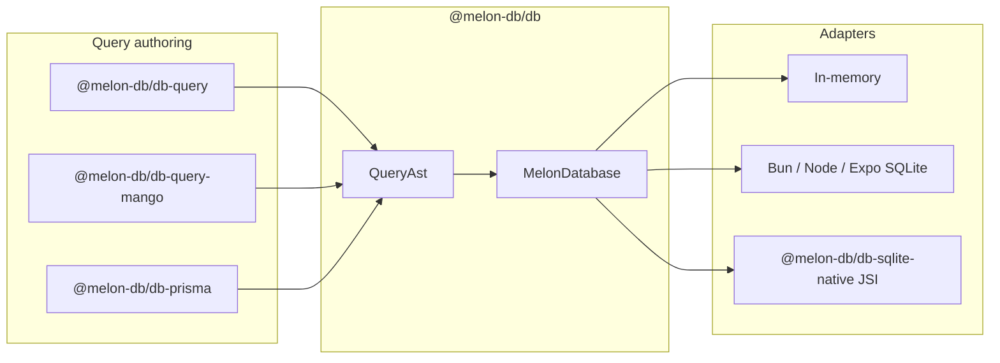
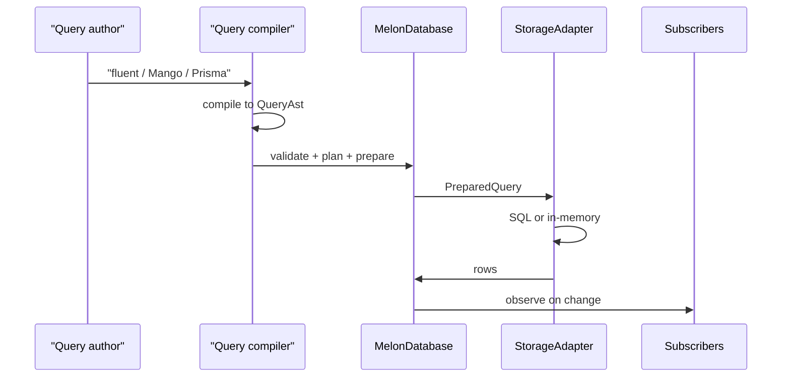
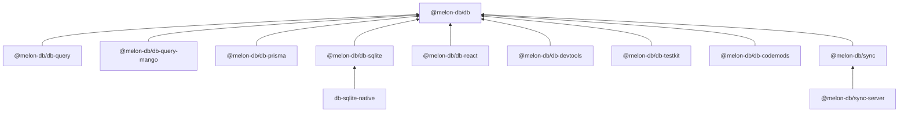
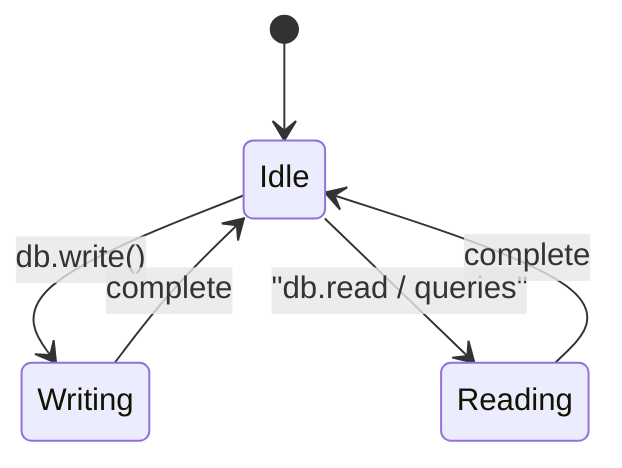

Melon uses an **AST-first** query architecture: every query surface compiles into one internal representation before reaching the storage adapter.

## System overview

*Query authoring surfaces compile to one AST; the engine routes to in-memory, Expo/Bun SQLite, or native JSI adapters.*

See [Packages](/docs/packages/melon-db) for per-package guides and [Architectural decisions](/docs/architecture/decisions) for ADRs with trade-offs.

## Package layers

| Package | Role |
|---------|------|
| `@melon-db/db` | Schema, AST, adapter contract, runtime engine, migrations, sync primitives |
| `@melon-db/db-sqlite` | SQLite adapter (Bun, Node, Expo Go, RN `/rn` export) |
| `@melon-db/db-sqlite-native` | Native TurboModule + C++ JSI for RN dev builds |
| `@melon-db/db-query` | Fluent query builder → AST |
| `@melon-db/db-query-mango` | Mango-style query compiler → AST |
| `@melon-db/db-prisma` | Prisma schema import + local client facade |
| `@melon-db/db-react` | React hooks and providers |
| `@melon-db/db-devtools` | Query / SQL / sync inspector |
| `@melon-db/db-testkit` | Test helpers and fixtures |
| `@melon-db/db-codemods` | WatermelonDB migration codemods |
| `@melon-db/sync` | Pull/push sync orchestrator |
| `@melon-db/sync-server` | HTTP reference backend (in-memory + Postgres) |

## Query pipeline

Steps in code:

1. Author query (fluent builder, Mango JSON, or Prisma-like args)
2. Compile to `QueryAst`
3. Validate against schema metadata
4. Plan and prepare (`PreparedQuery`)
5. Adapter encodes to SQL (SQLite) or in-memory evaluation
6. Results flow through reactive subscriptions (`MelonQueryHandle.observe`)

## Package dependencies

**Rules:**

- `@melon-db/db` is the bottom of the stack — no other melon packages
- Query packages compile to AST only; they never touch SQLite directly
- `@melon-db/sync` depends only on `@melon-db/db`
- React bindings wire subscriptions to UI; they do not own business logic

## Writes

All mutations run inside `db.write()`. The engine serializes writers and allows reads without concurrent writers.

Collection `insert`, `update`, and `delete` throw if called outside a write context.

## Subscriptions

**SQLite adapters** (`@melon-db/db-sqlite`) implement **`observeQuery`**: after each write, subscriptions are invalidated only when the changed row can affect the query’s WHERE clause (predicate-aware). Per-table triggers record writes to `_melon_observation_events` for future external-write polling.

**Other adapters** (in-memory, etc.) use the engine **ChangeEmitter**: any write to a collection re-fetches all active queries on that table.

The engine `observeQuery` helper prefers `adapter.observeQuery` when present. See [ADR-007](/docs/architecture/decisions#adr-007-changeemitter-fallback-vs-native-observequery).

## Related

- [Sync architecture](/docs/architecture/sync) — outbox, checkpoints, conflict policies
- [Native SQLite paths](/docs/architecture/native) — Expo Go vs dev build
- [Architectural decisions](/docs/architecture/decisions) — ADRs with pros and cons
