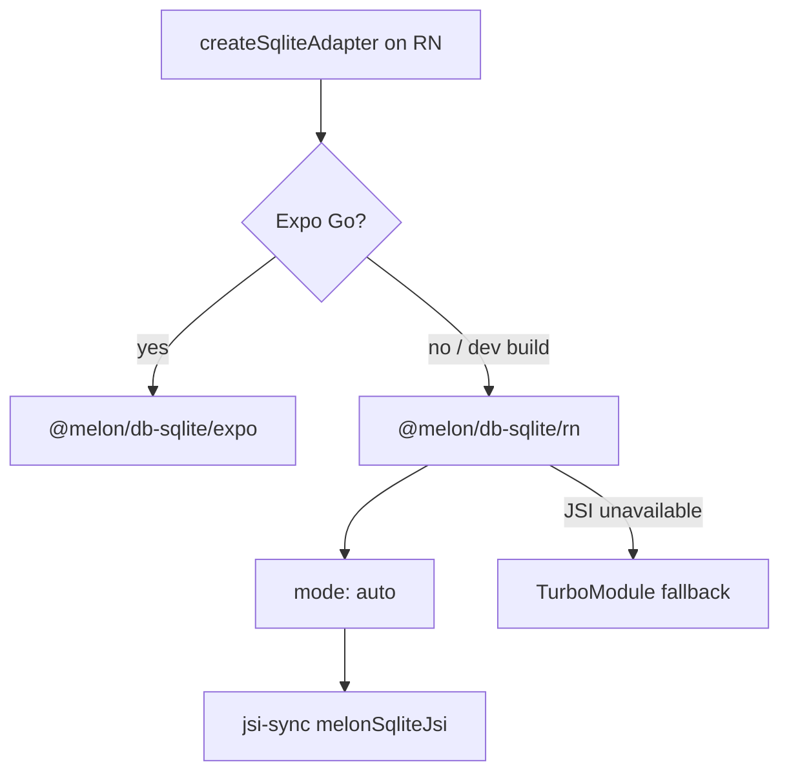
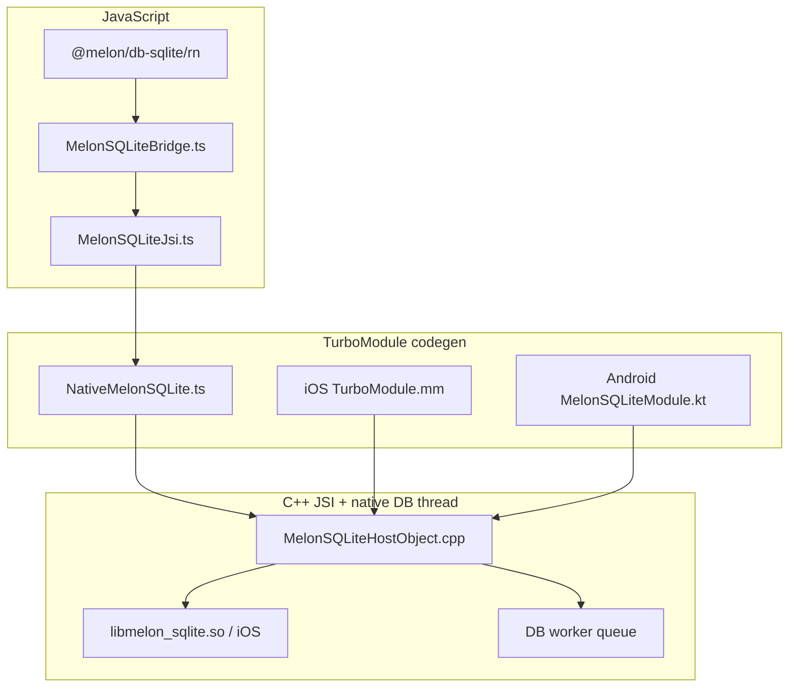

React Native has **two supported SQLite paths**. Choosing the wrong import is the most common setup mistake — use this page as a decision guide.

See [@melon/db-sqlite-native](/docs/packages/melon-db-sqlite-native) for setup and limitations. For the dual-path rationale see [ADR-005](/docs/architecture/decisions#adr-005-dual-rn-sqlite-path-expo-go-vs-dev-build) and [ADR-006](/docs/architecture/decisions#adr-006-layered-native-stack--turbomodule-then-c-jsi).

## Path decision

| Environment | Package / entry | Native module |
|-------------|-----------------|---------------|
| Expo Go | `@melon/db-sqlite/expo` | `expo-sqlite` (async) |
| Dev build (iOS/Android) | `@melon/db-sqlite/rn` | `@melon/db-sqlite-native` |
| Override to Expo driver in dev client | `EXPO_PUBLIC_MELON_SQLITE=expo` | `expo-sqlite` |
| Force TurboModule only | `EXPO_PUBLIC_MELON_SQLITE=turbo` | TurboModule promises |

Example apps:

- [`apps/playground-rn`](https://github.com/nwnichols02/melon/tree/main/apps/playground-rn) — Expo Go
- [`apps/playground-rn-dev`](https://github.com/nwnichols02/melon/tree/main/apps/playground-rn-dev) — native JSI dev build

## Native stack layers

Phases 20–26 built a layered native module:

**Phase 22–23:** TurboModule codegen (`MelonSQLiteSpec`) on iOS and Android.

**Phase 25–26:** C++ JSI host object installed as `global.melonSqliteJsi` on first Turbo call. Sync methods (`openSync`, `queryAllSync`, …) run on a dedicated native DB queue. JS thread blocks until the queue completes (documented trade-off for v1).

When JSI is present, `getMelonSQLiteNativeMode()` returns `jsi-sync`; otherwise `turbo`.

## Platform matrix

| Platform | C++ JSI sync | TurboModule fallback | Expo Go |
|----------|--------------|----------------------|---------|
| iOS dev build | Yes | Yes | No |
| Android dev build | Yes | Yes | No |
| Expo Go | No | No | Yes (`expo-sqlite`) |

## v1 native limitations

- No BLOB round-trip on the native JSI path
- Predicate-aware `observeQuery` in `@melon/db-sqlite` (all paths including native JSI)
- RN on-device benchmark harness deferred (Node `bench:compare` vs WatermelonDB ships today)

## Related

- [Performance comparison](/docs/performance-comparison) — Node-side Melon vs WatermelonDB benchmarks
- [Getting started — React Native](/docs/getting-started#react-native--expo)
