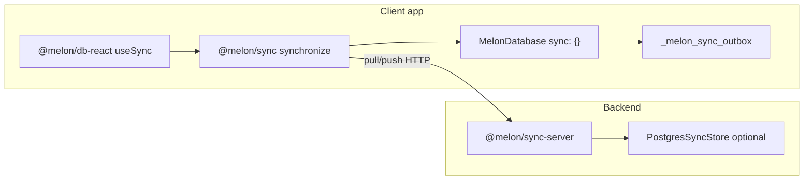
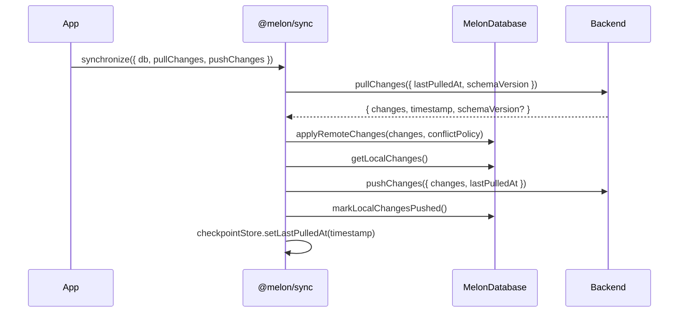
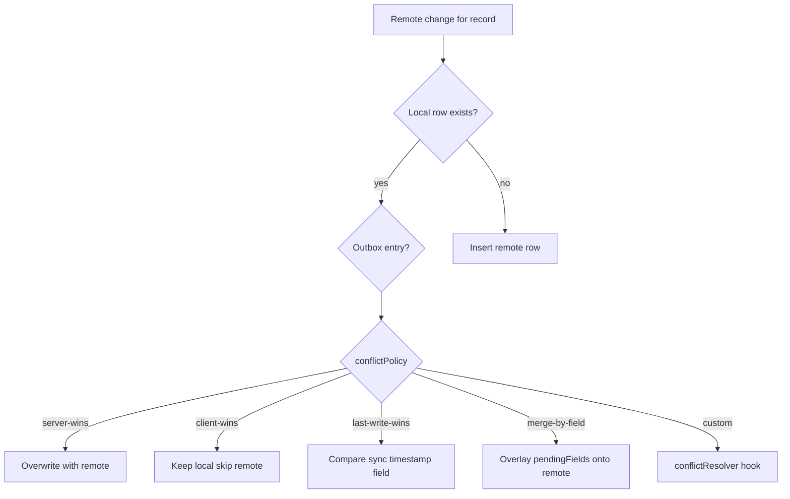

Sync is split across the engine and orchestrator: **`@melon/db`** owns change extraction and remote apply; **`@melon/sync`** owns the pull/push loop, retry, and status machine.

For usage examples see the [Sync guide](/docs/sync). For the split-package rationale see [ADR-002](/docs/architecture/decisions#adr-002-split-storage-and-sync-packages).

## Components

| Piece | Owner | Role |
|-------|-------|------|
| Outbox table | SQLite adapter + engine | Queues local creates/updates/deletes with optional `pendingFields` |
| `getLocalChanges()` | `@melon/db` | Watermelon-compatible change payloads for push |
| `applyRemoteChanges()` | `@melon/db` | Applies pull results with conflict policy |
| `synchronize()` | `@melon/sync` | Pull → apply → push → ack → checkpoint |
| Checkpoint store | `@melon/sync` | Persists `lastPulledAt` and schema version |
| Reference server | `@melon/sync-server` | In-memory or Postgres HTTP backend for dev |

## Pull/push sequence

## Conflict resolution flow

When a remote row collides with a local row (or outbox entry), `applyRemoteChanges` dispatches by policy:

Policies shipped in Phase 15–18:

- `server-wins` (default)
- `skip-existing`
- `client-wins`
- `last-write-wins` (requires `syncTimestampField`)
- `merge-by-field` — uses `pendingFields` on outbox entries (Phase 17)
- `custom` — pluggable `conflictResolver` (Phase 18)

## Migration-aware sync

Schema version travels with checkpoints. On pull, `buildPullMigration()` can describe client-side migration steps when server schema version advances. Strict vs lenient policies control whether sync pauses on mismatch.

## Status machine

`synchronize()` reports: `idle` → `pulling` → `pushing` → `complete`, with `retrying`, `paused` (offline), or `failed`. Retry uses exponential backoff with jitter; `AbortSignal` cancels in-flight pull/push.

## Related

- [Sync guide](/docs/sync) — API examples and React hooks
- [@melon/sync package](/docs/packages/melon-sync)
- [@melon/sync-server package](/docs/packages/melon-sync-server)
