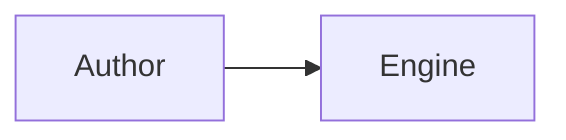

Canonical docs live in `apps/docs/content/docs/` as **MDX** files. The site uses [Fumadocs](https://www.fumadocs.dev/docs) on [TanStack Start](https://tanstack.com/start).

## When you ship a feature

1. Update the relevant `packages/<name>.mdx` page (status, examples).
2. Update [`prd-compliance.mdx`](/docs/prd-compliance) when `.cursor/rules/` PRDs change (including `prd-4` sliding-window items).
3. Update [`roadmap.mdx`](/docs/roadmap) — add or extend a **phase row** when a numbered phase completes; move items to deferred if scope slips.
4. For significant design choices, add an **ADR** to [`architecture/decisions.mdx`](/docs/architecture/decisions) (context, decision, pros, cons, alternatives).
5. Add JSDoc on new **public** exports.
6. Run `bun run docs:api` before release builds (regenerates package-scoped API titles via `scripts/generate-api.ts` + `fix-typedoc-links.ts`).
7. If benchmark scenarios change, update [performance comparison](/docs/performance-comparison), run `bun run bench:compare:docs`, commit `apps/docs/src/data/bench-compare-latest.json`, and update [`packages/melon-db-sqlite/README.md`](https://github.com/melon/melon/blob/main/packages/melon-db-sqlite/README.md).

## Page tree

Edit `meta.json` files next to MDX folders to reorder the sidebar.

Key sections:

| Section | Path |
|---------|------|
| About / vision | `about.mdx` |
| Roadmap / phases | `roadmap.mdx` |
| PRD compliance | `prd-compliance.mdx` |
| Walkthroughs | `walkthroughs/` |
| Architecture | `architecture/` (overview, ADRs, sync, native) |
| API reference | `api/` (TypeDoc output — do not hand-edit symbol pages) |

## API reference

TypeDoc runs **once per package** with a scoped title (`@melon/db API Reference`). Shared metadata lives in `apps/docs/scripts/api-package-meta.ts`. To add a package to the API sidebar, extend `API_PACKAGES` there and in `content/docs/api/meta.json`, then run `bun run docs:api`.

## Playgrounds

Interactive demos live under `content/docs/playgrounds/` and import client-only React components from `apps/docs/src/components/playgrounds/`.

## Architecture diagrams

Author diagrams as fenced **mermaid** blocks in `.mdx` files:

````md

````

The MDX pipeline uses `remarkMdxMermaid` from `fumadocs-core/mdx-plugins` (configured in `apps/docs/source.config.ts`). It must run **before** code-highlighting plugins so diagram source is not treated as a code block. At build time, fences become `<Mermaid chart="..." />`; the client component in `apps/docs/src/components/mdx/mermaid.tsx` renders SVG and respects light/dark theme.

Optional captions: add italic prose directly below the fence.

## Phase tracking

See [`.cursor/phases/docs-fumadocs.md`](https://github.com/melon/melon/blob/main/.cursor/phases/docs-fumadocs.md) for exit criteria and ongoing doc rules.

## Agent / Cursor

- Repo guide: [`AGENTS.md`](https://github.com/melon/melon/blob/main/AGENTS.md)
- Melon dev skill: `.cursor/skills/melon-dev/SKILL.md`
- TanStack docs rule: `.cursor/rules/melon-tanstack.mdc`
- TypeScript conventions: [contributing/typescript](/docs/contributing/typescript)
